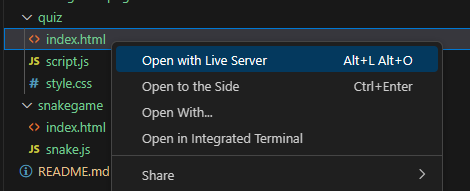
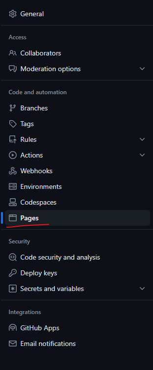
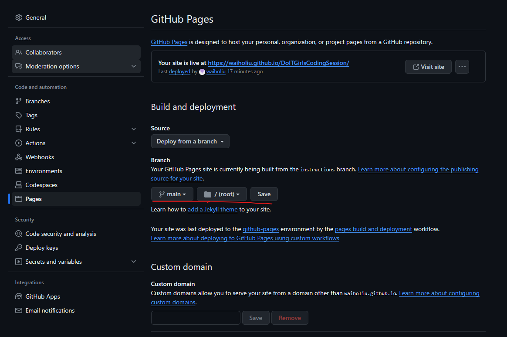

# Do IT Girls Coding Session!

Today we are going to make our first game! How exciting!

## Register for Github

Todo - add instructions to register for github

## Fork this repo

Click on the Fork button to create your own copy of your repo


## Create a codespace

Click on the create codespace button


## Select a game you want to make

Ok so there's two games you can try out depending on your interest. The Quiz game and the Snake game. 

### Quiz game

1. Create a file called index.html and put the following code

```
<html lang="en">

<head>

  <meta charset="UTF-8">

  <meta name="viewport" content="width=device-width, initial-scale=1.0">

  <meta http-equiv="X-UA-Compatible" content="ie=edge">

  <link href="style.css" rel="stylesheet">

  <script defer src="script.js"></script>

  <title>Quiz App</title>

</head>

<body>

  <div class="container">

    <div id="question-container" class="hide">

      <div id="question">Question</div>

      <div id="answer-buttons" class="btn-grid">

        <button class="btn">Answer 1</button>

        <button class="btn">Answer 2</button>

        <button class="btn">Answer 3</button>

        <button class="btn">Answer 4</button>

      </div>

    </div>

    <div class="controls">

      <button id="start-btn" class="start-btn btn">Start</button>

      <button id="next-btn" class="next-btn btn hide">Next</button>

    </div>

  </div>

</body>

</html>
```

2. Create a file called script.js and paste the following in

```
const startButton = document.getElementById('start-btn')

const nextButton = document.getElementById('next-btn')

const questionContainerElement = document.getElementById('question-container')

const questionElement = document.getElementById('question')

const answerButtonsElement = document.getElementById('answer-buttons')

let shuffledQuestions, currentQuestionIndex

startButton.addEventListener('click', startGame)

nextButton.addEventListener('click', () => {

  currentQuestionIndex++

  setNextQuestion()

})

function startGame() {

  startButton.classList.add('hide')

  shuffledQuestions = questions.sort(() => Math.random() - .5)

  currentQuestionIndex = 0

  questionContainerElement.classList.remove('hide')

  setNextQuestion()

}

function setNextQuestion() {

  resetState()

  showQuestion(shuffledQuestions[currentQuestionIndex])

}

function showQuestion(question) {

  questionElement.innerText = question.question

  question.answers.forEach(answer => {

    const button = document.createElement('button')

    button.innerText = answer.text

    button.classList.add('btn')

    if (answer.correct) {

      button.dataset.correct = answer.correct

    }

    button.addEventListener('click', selectAnswer)

    answerButtonsElement.appendChild(button)

  })

}

function resetState() {

  clearStatusClass(document.body)

  nextButton.classList.add('hide')

  while (answerButtonsElement.firstChild) {

    answerButtonsElement.removeChild(answerButtonsElement.firstChild)

  }

}

function selectAnswer(e) {

  const selectedButton = e.target

  const correct = selectedButton.dataset.correct

  setStatusClass(document.body, correct)

  Array.from(answerButtonsElement.children).forEach(button => {

    setStatusClass(button, button.dataset.correct)

  })

  if (shuffledQuestions.length > currentQuestionIndex + 1) {

    nextButton.classList.remove('hide')

  } else {

    startButton.innerText = 'Restart'

    startButton.classList.remove('hide')

  }

}

function setStatusClass(element, correct) {

  clearStatusClass(element)

  if (correct) {

    element.classList.add('correct')

  } else {

    element.classList.add('wrong')

  }

}

function clearStatusClass(element) {

  element.classList.remove('correct')

  element.classList.remove('wrong')

}

const questions = [

  {

    question: 'What is 2 + 2?',

    answers: [

      { text: '4', correct: true },

      { text: '22', correct: false }

    ]

  },

  {

    question: 'Who is the best YouTuber?',

    answers: [

      { text: 'Web Dev Simplified', correct: true },

      { text: 'Traversy Media', correct: true },

      { text: 'Dev Ed', correct: true },

      { text: 'Fun Fun Function', correct: true }

    ]

  },

  {

    question: 'Is web development fun?',

    answers: [

      { text: 'Kinda', correct: false },

      { text: 'YES!!!', correct: true },

      { text: 'Um no', correct: false },

      { text: 'IDK', correct: false }

    ]

  },

  {

    question: 'What is 4 * 2?',

    answers: [

      { text: '6', correct: false },

      { text: '8', correct: true }

    ]

  }

]
```


3. Create a file called style.css and paste the following in


```
*, *::before, *::after {

    box-sizing: border-box;
  
    font-family: Gotham Rounded;
  
  }
  
  :root {
  
    --hue-neutral: 200;
  
    --hue-wrong: 0;
  
    --hue-correct: 145;
  
  }
  
  body {
  
    --hue: var(--hue-neutral);
  
    padding: 0;
  
    margin: 0;
  
    display: flex;
  
    width: 100vw;
  
    height: 100vh;
  
    justify-content: center;
  
    align-items: center;
  
    background-color: hsl(var(--hue), 100%, 20%);
  
  }
  
  body.correct {
  
    --hue: var(--hue-correct);
  
  }
  
  body.wrong {
  
    --hue: var(--hue-wrong);
  
  }
  
  .container {
  
    width: 800px;
  
    max-width: 80%;
  
    background-color: white;
  
    border-radius: 5px;
  
    padding: 10px;
  
    box-shadow: 0 0 10px 2px;
  
  }
  
  .btn-grid {
  
    display: grid;
  
    grid-template-columns: repeat(2, auto);
  
    gap: 10px;
  
    margin: 20px 0;
  
  }
  
  .btn {
  
    --hue: var(--hue-neutral);
  
    border: 1px solid hsl(var(--hue), 100%, 30%);
  
    background-color: hsl(var(--hue), 100%, 50%);
  
    border-radius: 5px;
  
    padding: 5px 10px;
  
    color: white;
  
    outline: none;
  
  }
  
  .btn:hover {
  
    border-color: black;
  
  }
  
  .btn.correct {
  
    --hue: var(--hue-correct);
  
    color: black;
  
  }
  
  .btn.wrong {
  
    --hue: var(--hue-wrong);
  
  }
  
  .start-btn, .next-btn {
  
    font-size: 1.5rem;
  
    font-weight: bold;
  
    padding: 10px 20px;
  
  }
  
  .controls {
  
    display: flex;
  
    justify-content: center;
  
    align-items: center;
  
  }
  
  .hide {
  
    display: none;
  
  }
  ```


### Snake game

Create a 


## Testing out the game

Right click on the file you want and click Open with Live Server




## deploy to github pages

Go to Settings


Go to Pages




Set branch to Main and save



Give it a minute - navigate to https://<yourusername>.github.io/<reponame> and you now have a publicly available webpage. Every time you make changes to your code, it'll automatically update too - send it to a friend!


## additional challenges

## Quiz 
-  How can I add a title to the page
-  


### Snake Game

- How can I change the colours of the dots and the background?
- How can I slow down or speed up the snake?
- How can I add a title to the page


