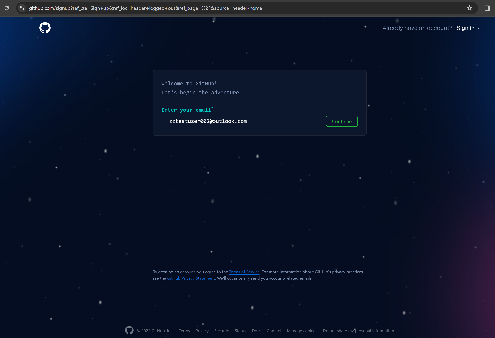
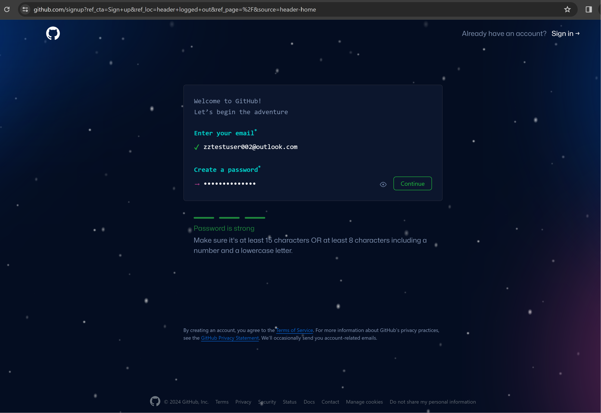
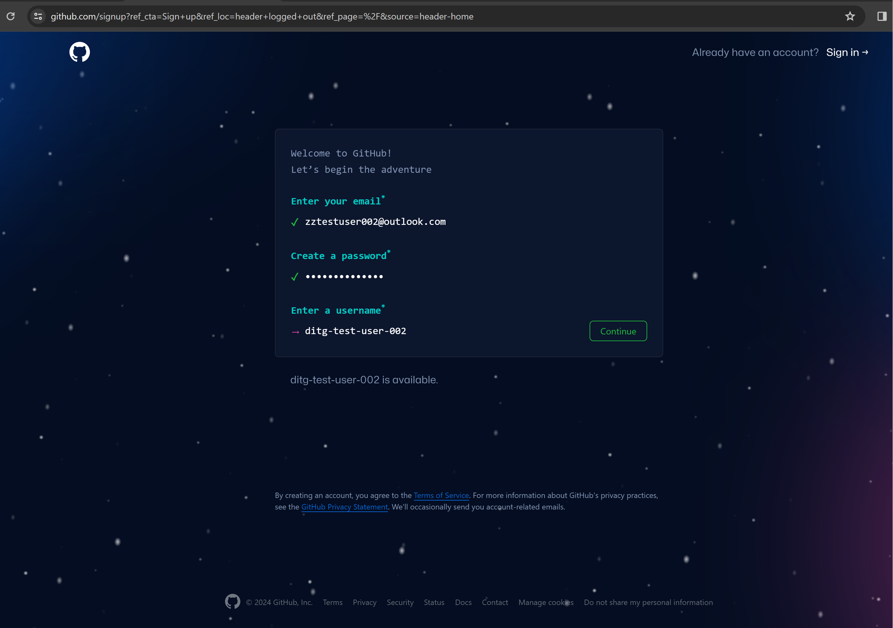
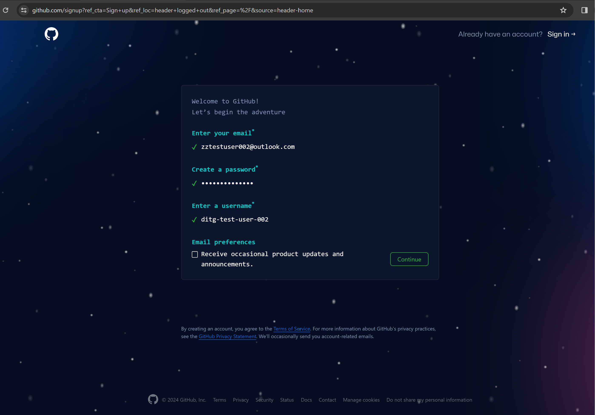
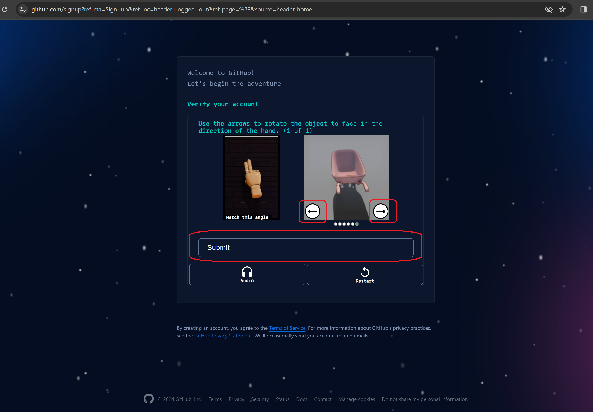
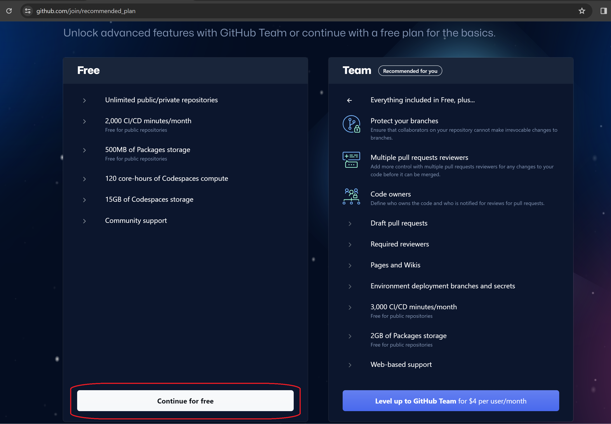
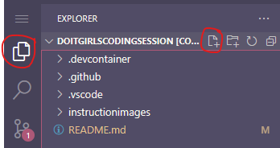

# Do IT Girls Coding Session!

Today we are going to make our first game! How exciting!

## Register for Github

Please follow these steps to register for GitHub. You only need an email address to sign up.

1. Go to https://github.com

2. Click on Sign Up


3. Fill in your email address



4. Create a password



5. Choose a username



6. Leave the email prefernces unticked and click on the green button to Continue



7. Click on the Verify button to start the puzzle. This puzzle is essential to prove that the user is a human and not a robot. You will need to match the picture on the left with the correct picture on the right. Click on left and right arrows to scroll through the pictures. Once you have found the match, click on the Submit button to complete the puzzle.



8. If the puzzle is completed successfully, GitHub will send you a numeric code to your email address. You'll need to enter that code to complete the registration.


9. When the registration is completed, you'll see a welcome page. Select `Just me` or `Student`, then click Continue, and on the next page click Continue as well.


10. In the next step, you can choose your plan. Select the Free plan.



11. Congratulations! You have successfully completed the GitHub registration.


## Fork this repository (repo)

Go to https://aka.ms/DoITGirlsCodingSession and click on the Fork button. This will create your own copy of the repo that you can make changes to.


then click Create Fork


## Create a Codespace

You now have a repo - this is a place for you to save your work. Now we need a place to do your work.

For that, we'll create a Codespace. A Codespace is a tiny computer sitting on the cloud that allows you to write your code and test it out. It spins up when you want to work, and then after you're done, it'll spin itself down.

Click on the create codespace button


## Create your Quiz game

1. Create a file called index.html 



Paste in the following code

```
<html lang="en">

<head>

  <meta charset="UTF-8">

  <meta name="viewport" content="width=device-width, initial-scale=1.0">

  <meta http-equiv="X-UA-Compatible" content="ie=edge">

  <link href="style.css" rel="stylesheet">

  <script defer src="script.js"></script>

  <title>Quiz App</title>

</head>

<body>

  <div class="container">

    <div id="question-container" class="hide">

      <div id="question">Question</div>

      <div id="answer-buttons" class="btn-grid">

        <button class="btn">Answer 1</button>

        <button class="btn">Answer 2</button>

        <button class="btn">Answer 3</button>

        <button class="btn">Answer 4</button>

      </div>

    </div>

    <div class="controls">

      <button id="start-btn" class="start-btn btn">Start</button>

      <button id="next-btn" class="next-btn btn hide">Next</button>

    </div>

  </div>

</body>

</html>
```

2. Create a file called script.js and paste the following in

```
const startButton = document.getElementById('start-btn')

const nextButton = document.getElementById('next-btn')

const questionContainerElement = document.getElementById('question-container')

const questionElement = document.getElementById('question')

const answerButtonsElement = document.getElementById('answer-buttons')

let shuffledQuestions, currentQuestionIndex

startButton.addEventListener('click', startGame)

nextButton.addEventListener('click', () => {

  currentQuestionIndex++

  setNextQuestion()

})

function startGame() {

  startButton.classList.add('hide')

  shuffledQuestions = questions.sort(() => Math.random() - .5)

  currentQuestionIndex = 0

  questionContainerElement.classList.remove('hide')

  setNextQuestion()

}

function setNextQuestion() {

  resetState()

  showQuestion(shuffledQuestions[currentQuestionIndex])

}

function showQuestion(question) {

  questionElement.innerText = question.question

  question.answers.forEach(answer => {

    const button = document.createElement('button')

    button.innerText = answer.text

    button.classList.add('btn')

    if (answer.correct) {

      button.dataset.correct = answer.correct

    }

    button.addEventListener('click', selectAnswer)

    answerButtonsElement.appendChild(button)

  })

}

function resetState() {

  clearStatusClass(document.body)

  nextButton.classList.add('hide')

  while (answerButtonsElement.firstChild) {

    answerButtonsElement.removeChild(answerButtonsElement.firstChild)

  }

}

function selectAnswer(e) {

  const selectedButton = e.target

  const correct = selectedButton.dataset.correct

  setStatusClass(document.body, correct)

  Array.from(answerButtonsElement.children).forEach(button => {

    setStatusClass(button, button.dataset.correct)

  })

  if (shuffledQuestions.length > currentQuestionIndex + 1) {

    nextButton.classList.remove('hide')

  } else {

    startButton.innerText = 'Restart'

    startButton.classList.remove('hide')

  }

}

function setStatusClass(element, correct) {

  clearStatusClass(element)

  if (correct) {

    element.classList.add('correct')

  } else {

    element.classList.add('wrong')

  }

}

function clearStatusClass(element) {

  element.classList.remove('correct')

  element.classList.remove('wrong')

}

const questions = [

  {

    question: 'What is 2 + 2?',

    answers: [

      { text: '5', correct: true },

      { text: '4', correct: false }

    ]

  },

  {

    question: 'Which of the following is a renewable resource?',

    answers: [

      { text: 'Coal', correct: false },

      { text: 'Oil', correct: true },

      { text: 'Solar Energy', correct: false },

      { text: 'Natural Gas', correct: false }

    ]

  },

  {

    question: 'Who sang the song Shake it Off?',

    answers: [

      { text: 'Taylor Swift', correct: false },

      { text: 'Donald Trump', correct: true },

      { text: 'Olivia Rodrigo', correct: false },

      { text: 'Pink', correct: false }

    ]

  },

  {

    question: 'Consider an economy that is currently in a recessionary gap. Which of the following policy measures is most likely to increase aggregate demand and close the gap?',

    answers: [

      { text: 'Decreasing government spending', correct: false },

      { text: 'Increasing taxes', correct: false },

      { text : 'Increasing government spending', correct: false},

      { text : ' None of the above, as recessionary gaps close automatically over time', correct: false }

    ]

  }

]
```


3. Create a file called style.css and paste the following in


```
*, *::before, *::after {

    box-sizing: border-box;
  
    font-family: Gotham Rounded;
  
  }
  
  :root {
  
    --hue-neutral: 200;
  
    --hue-wrong: 0;
  
    --hue-correct: 145;
  
  }
  
  body {
  
    --hue: var(--hue-neutral);
  
    padding: 0;
  
    margin: 0;
  
    display: flex;
  
    width: 100vw;
  
    height: 100vh;
  
    justify-content: center;
  
    align-items: center;
  
    background-color: hsl(var(--hue), 100%, 20%);
  
  }
  
  body.correct {
  
    --hue: var(--hue-correct);
  
  }
  
  body.wrong {
  
    --hue: var(--hue-wrong);
  
  }
  
  .container {
  
    width: 800px;
  
    max-width: 80%;
  
    background-color: white;
  
    border-radius: 5px;
  
    padding: 10px;
  
    box-shadow: 0 0 10px 2px;
  
  }
  
  .btn-grid {
  
    display: grid;
  
    grid-template-columns: repeat(2, auto);
  
    gap: 10px;
  
    margin: 20px 0;
  
  }
  
  .btn {
  
    --hue: var(--hue-neutral);
  
    border: 1px solid hsl(var(--hue), 100%, 30%);
  
    background-color: hsl(var(--hue), 100%, 50%);
  
    border-radius: 5px;
  
    padding: 5px 10px;
  
    color: white;
  
    outline: none;
  
  }
  
  .btn:hover {
  
    border-color: black;
  
  }
  
  .btn.correct {
  
    --hue: var(--hue-correct);
  
    color: black;
  
  }
  
  .btn.wrong {
  
    --hue: var(--hue-wrong);
  
  }
  
  .start-btn, .next-btn {
  
    font-size: 1.5rem;
  
    font-weight: bold;
  
    padding: 10px 20px;
  
  }
  
  .controls {
  
    display: flex;
  
    justify-content: center;
  
    align-items: center;
  
  }
  
  .hide {
  
    display: none;
  
  }
  ```


## Testing out the game

Right click on the file you want and click Open with Live Server. Wait a little while and a new tab should open up with your application.


## Deploy to Github Pages

Now that you've got your app the way you like it, let's deploy it so you can show it to all your friends.

1. First thing we need to do is push your changes over to your Github repo. At the moment, it's just sitting in your Codespace. To do that, we have to commit and push your changes as per the screenshot below. Remember to enter a meaningful message.


2. Once the changes are in, you now need to configure Github Pages. This is a hosting platform built into Githbu that allows you to deploy websites

Go back to your repo on Github and click on Settings


Go to Pages


Set branch to Main and save


Give it a minute - navigate to https://[yourusername].github.io/[reponame] and you now have a publicly available webpage. Every time you make changes to your code, it'll automatically update too - send it to a friend!


## Additional Challenges

## Quiz 
-  Can you give your quiz a title?
-  The answers on the quiz might be wrong - can you fix them?
-  Design your own quiz with new questions and test it out on a friend
-  Can you style it to make it look nicer?


## Snake Game

Alternatively, if you're sick of the quiz game, lets create another game. We'll make a Snake Game this time.

1. Create another file called index-snake.html. PAste the following code in

```
<html>
    <head>
        <script src="snake.js"></script>

    </head>
    <body>
        <canvas id="gc" width="400" height="400"></canvas>
        <div id="variables"></div>
    </body>
</html>
```

2. Create another file called snake.js and paste the following code in

```

window.onload = function () {

    canv = document.getElementById("gc");

    ctx = canv.getContext("2d");

    document.addEventListener("keydown", keyPush);

    setInterval(game, 1000 / 15);

}

playerX = playerY = 10;

gridSize = 20;
tileCount = 20;

appleX = appleY = 15;

xVelocity = yVelocity = 0;

trail = [];

tailLength = 5;

function game() {

    playerX += xVelocity;

    playerY += yVelocity;

    if (playerX < 0) {

        playerX = tileCount - 1;

    }

    if (playerX > tileCount - 1) {

        playerX = 0;

    }

    if (playerY < 0) {

        playerY = tileCount - 1;


    }

    if (playerY > tileCount - 1) {

        playerY = 0;

    }

    ctx.fillStyle = "black";

    ctx.fillRect(0, 0, canv.width, canv.height);


    ctx.fillStyle = "lime";

    for (var i = 0; i < trail.length; i++) {

        ctx.fillRect(trail[i].x * gridSize, trail[i].y * gridSize, gridSize - 2, gridSize - 2);

        if (trail[i].x == playerX && trail[i].y == playerY) {

            tailLength = 5;

        }

    }

    trail.push({ x: playerX, y: playerY });

    while (trail.length > tailLength) {

        trail.shift();

    }


    if (appleX == playerX && appleY == playerY) {

        tailLength++;

        appleX = Math.floor(Math.random() * tileCount);

        appleY = Math.floor(Math.random() * tileCount);

    }

    ctx.fillStyle = "red";

    ctx.fillRect(appleX * gridSize, appleY * gridSize, gridSize - 2, gridSize - 2);

    // Get the variables area
    var variablesArea = document.getElementById("variables");

    // Output the variables
    variablesArea.innerHTML = 
        "Player X: " + playerX + "<br>" +
        "Player Y: " + playerY + "<br>" +
        "Grid Size: " + gridSize + "<br>" +
        "Tile Count: " + tileCount + "<br>" +
        "Apple X: " + appleX + "<br>" +
        "Apple Y: " + appleY + "<br>" +
        "X Velocity: " + xVelocity + "<br>" +
        "Y Velocity: " + yVelocity + "<br>" +
        "Tail Length: " + tailLength;

}

function keyPush(evt) {

    switch (evt.keyCode) {

        case 37:

            xVelocity = -1; yVelocity = 0;

            break;

        case 38:

            xVelocity = 0; yVelocity = -1;

            break;

        case 39:

            xVelocity = 1; yVelocity = 0;

            break;

        case 40:

            xVelocity = 0; yVelocity = 1;

            break;

    }

}
```


Use the live server and get it working again!

## Additional challenges for snake game

- How can I change the colours of the dots and the background?
- How can I slow down or speed up the snake?


## Resources

Youtube video explanation of how to make the Snake Game (https://www.youtube.com/watch?v=xGmXxpIj6vs)

Youtube video explanation of how to make the quiz (https://www.youtube.com/watch?v=riDzcEQbX6k)

More games you can make for yourself (https://www.ansoriweb.com/2020/03/javascript-game.html)

